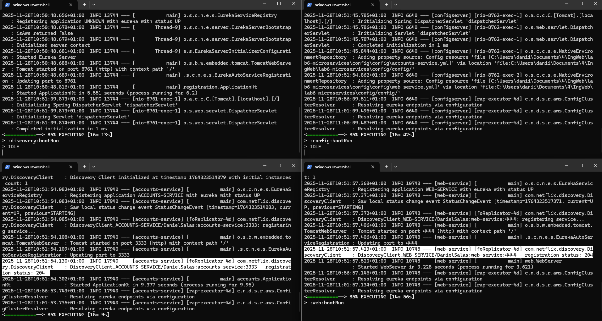
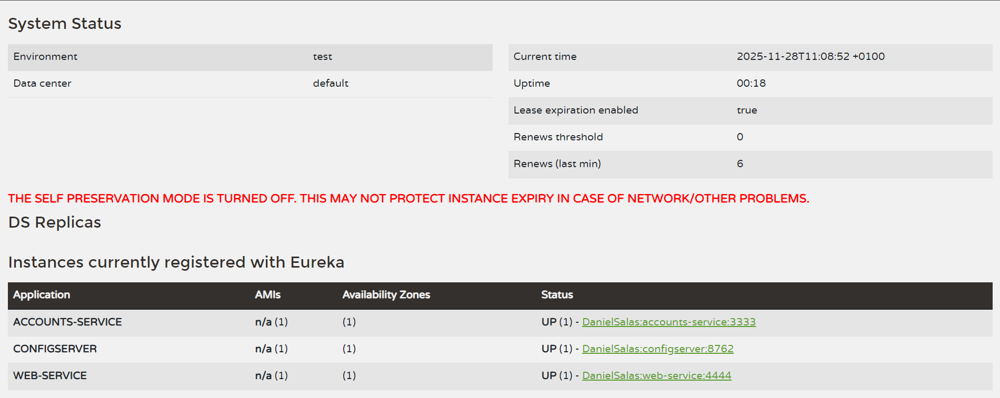
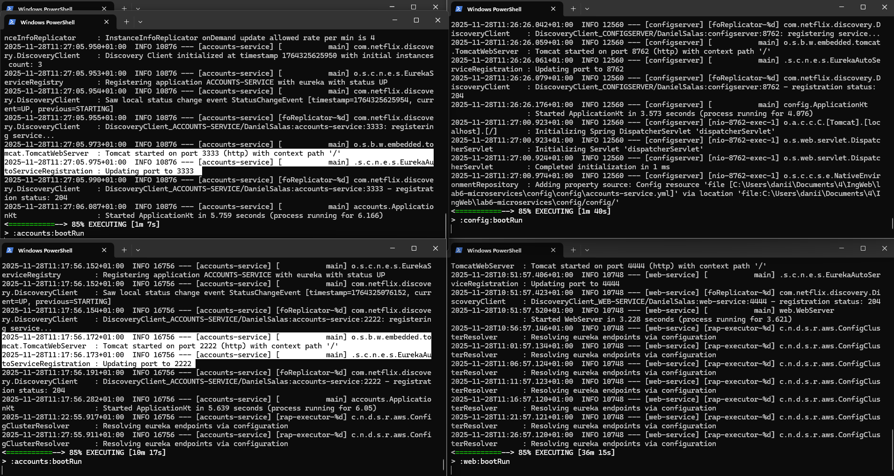
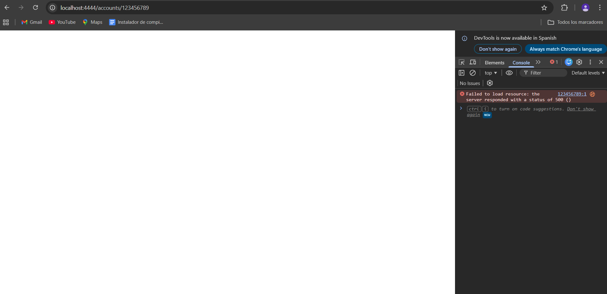
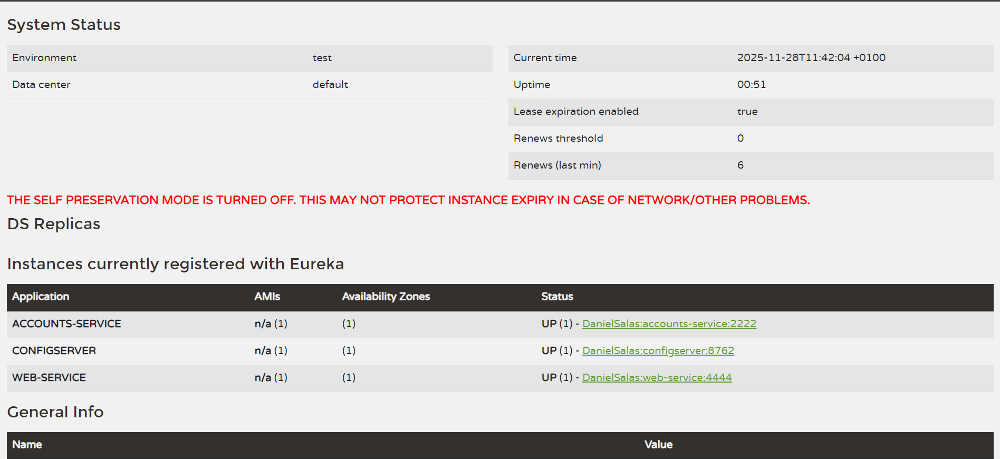
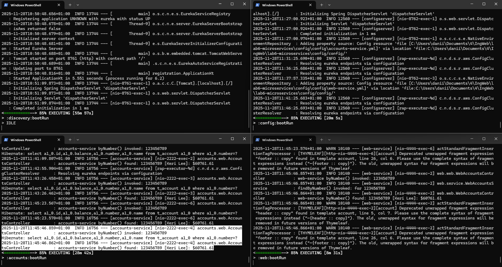
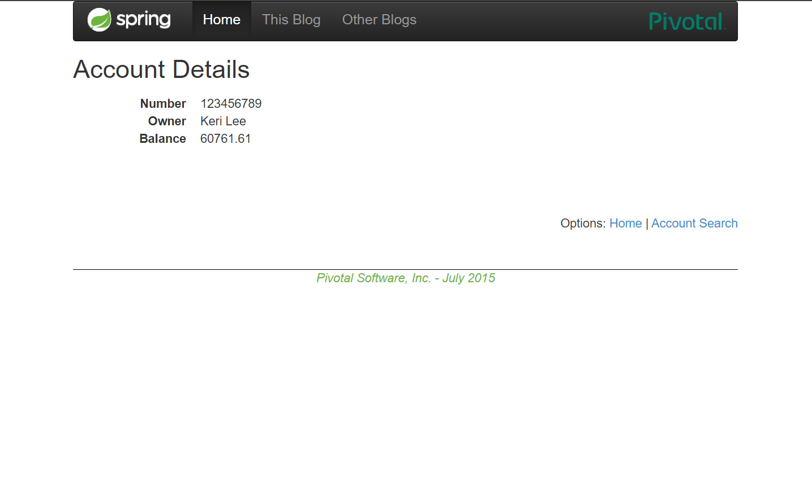

# Lab 6 Microservices - Project Report

## 1. Configuration Setup

### Description of configuration files in `config/config/`

- `accounts-service.yml`: contains the configuration for the Accounts Service, including server port and properties for Eureka and the Config Server.
- `web-service.yml`: contains the configuration for the Web Service, including port, application name, and Eureka/Config Server properties.
### Description of changes made to configuration

- Changed the `Accounts Service` port from **3333 to 2222** in `accounts-service.yml` for Task 3.
- For Task 4, temporarily changed the port to **3333** to start a second instance.
- Restarted the Config Server after each change so that services would load the updated configuration.

---

## 2. Service Registration (Task 1)

### Log Screenshot of both services registering

### Brief explanation of the registration process

- When a microservice starts, the Eureka client automatically registers it with the Eureka server (discovery-service).
- Eureka stores information about each instance, including port, hostname, and status (`UP`).
- Communication occurs via HTTP, and a `status code 204` indicates successful registration with no content returned.

---

## 3. Eureka Dashboard (Task 2)

### Explanation of what the dashboard shows

- The dashboard displays all services registered in Eureka.
- Both **ACCOUNTS-SERVICE** and **WEB-SERVICE** are visible, each with its active instance.
- Each service shows its status (`UP`) and details such as port, hostname, and time since the last heartbeat.

---

## 4. Multiple Instances (Task 4)
### Logs screenshot with multiple instances

### Dashboard screenshot with multiple instances

### Explanation of how Eureka handles multiple instances

- Eureka identifies services by the name of the service and the port.
- Multiple instances of the same service are registered under the same name, but with different ports.
- This allows clients to discover all available instances and perform load balancing.

### How does client-side load balancing work?

- The Web Service discovers all available instances of the Accounts Service via Eureka.
- Requests are automatically distributed between the available instances.
- This ensures that if one instance fails, the other can still serve requests.
- In our case, with instances on ports 2222 and 3333, requests were alternated between them, as shown in the logs.

### What happens when you start the second instance?
- When the second instance of the Accounts Service is started on port 2222, it registers itself with Eureka. In the 
dashboard, both instances are shown as `UP` and ready to handle requests. The Web Service can now route requests to either instance,
enabling load balancing and redundancy.
---

## 5. Service Failure Analysis (Task 5)

### Screenshots of error behavior

### Dashboard screenshot showing instance removal

### What happens to requests immediately after stopping the service?
- Immediately after stopping the instance on port 3333, requests to the Accounts Service may fail, resulting in errors, because the Web Service could request both
  instance until Eureka updates its registry. Once Eureka detects the failure and removes the instance, the Web Service routes all requests to the remaining live instance on port 2222,

### Explanation of the failure detection mechanism

- Eureka detects failures through periodic heartbeats from each instance.
- If an instance stops sending heartbeats during the configured timeout, Eureka marks it as down and removes it from the registry.
- During this initial period, some requests may fail until the Web Service routes all traffic to the remaining live instance.
---

## 6. Service Recovery Analysis (Task 6)
### Screenshots of recovered state

- **Web Service functioning correctly:**

- **Eureka Dashboard showing only the live instance (2222):**

### Explanation of why recovery works

- Recovery works because Eureka automatically removes failed instances after the heartbeat timeout.
- The Web Service detects the change in Eureka and routes all requests to the remaining active instance, ensuring service continuity without manual intervention.

### How long did recovery take?

- Approximately **30–60 seconds** from stopping the 3333 instance until Eureka removed it and the Web Service routed all requests to the remaining live instance.

---

## 7. AI Disclosure

**Did you use AI tools?** (ChatGPT, Copilot, Claude, etc.)
Yes, I used copilot to help structure and refine parts of this report. However, the explanations and the process were done by me, I 
only used AI to help with formatting and grammar.

